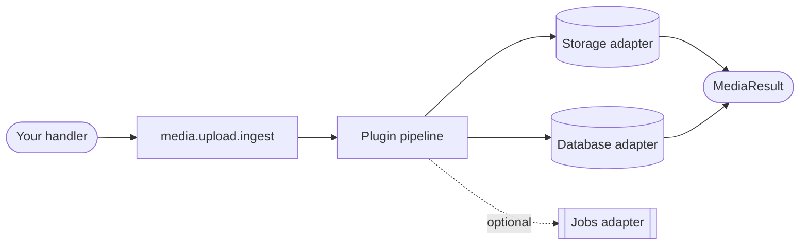
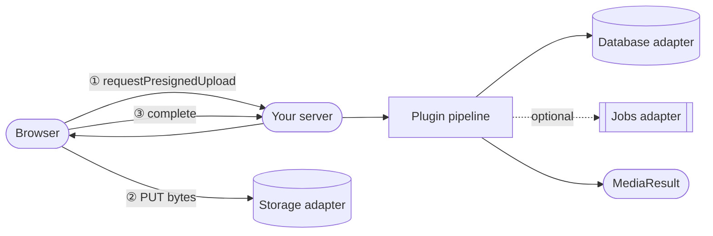

Better Media is a server-side media pipeline framework. You configure it once — wiring storage, a database, and plugins — and get back a single `media` runtime your handlers call into. The framework owns the pipeline; it does not own your HTTP layer, your queue, or your schema beyond what it needs.

## The three layers

| Layer | What it is |
|---|---|
| **Factory** | `createBetterMedia()` — assembles storage, DB, plugins, and jobs into a runtime |
| **Runtime** | The `media` object — `upload`, `files`, `system`, and `runBackgroundJob` |
| **Adapters** | Storage and database are swappable; plugins extend the pipeline |

## Server-side ingest

Every file that enters the system through your server follows the same path:

1. Your handler calls `media.upload.ingest` with a file source (buffer, stream, path, or URL) and metadata
2. The **plugin pipeline** runs — validation, transformation, and any side effects you've registered
3. Bytes land in the **storage adapter**; a media record is written to the **database adapter**
4. Background work (transcoding, post-processing) is enqueued via the **jobs adapter** if configured
5. A `MediaResult` — id, key, status — comes back to your handler

## Direct uploads

For client-to-storage uploads, your server issues a presigned token and steps out of the data path:

The browser uploads directly to storage; `media.upload.complete` picks up after and runs the same plugin pipeline as server-side ingest. See [Client](/docs/architecture/client) for the browser-side SDK.

## What's in this section

- [API](/docs/architecture/api) — the `createBetterMedia` factory, runtime namespaces, and all method signatures
- [CLI](/docs/architecture/cli) — schema bootstrap, migration generation, and applying migrations
- [Database](/docs/architecture/database) — adapter interface, schema, and migration patterns
- [Hooks & Webhooks](/docs/architecture/events) — reacting to pipeline events in-process and over HTTP
- [Plugins](/docs/architecture/plugins) — the plugin lifecycle, context shape, and writing your own
- [Rate Limiting](/docs/architecture/rate-limit) — per-user and per-tenant upload throttling
- [Background Jobs](/docs/architecture/jobs) — the jobs adapter interface and worker wiring
